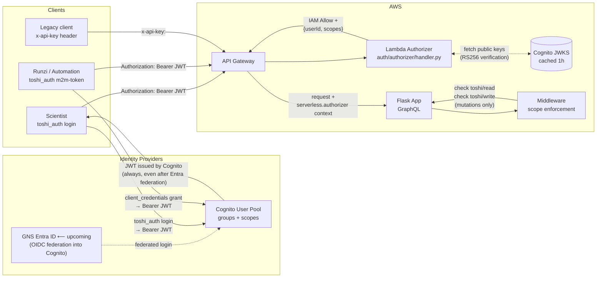
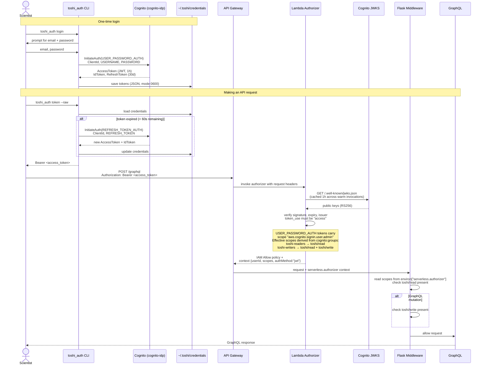
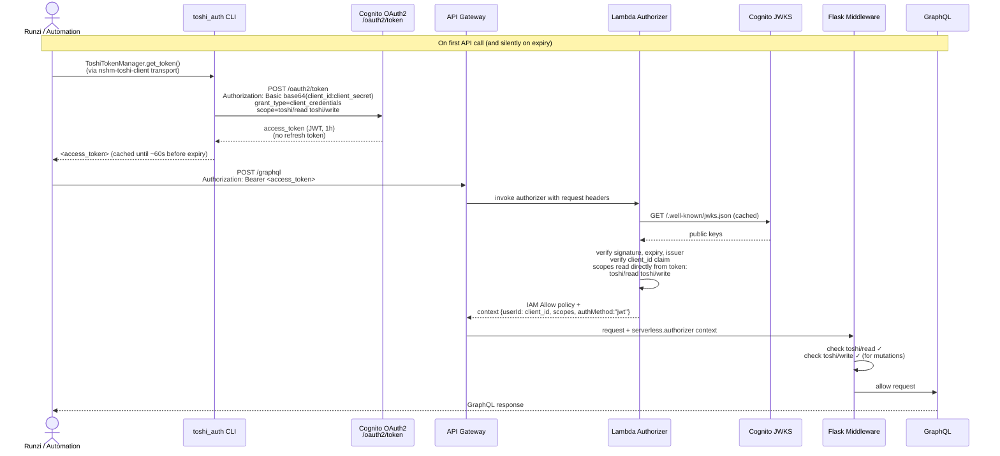
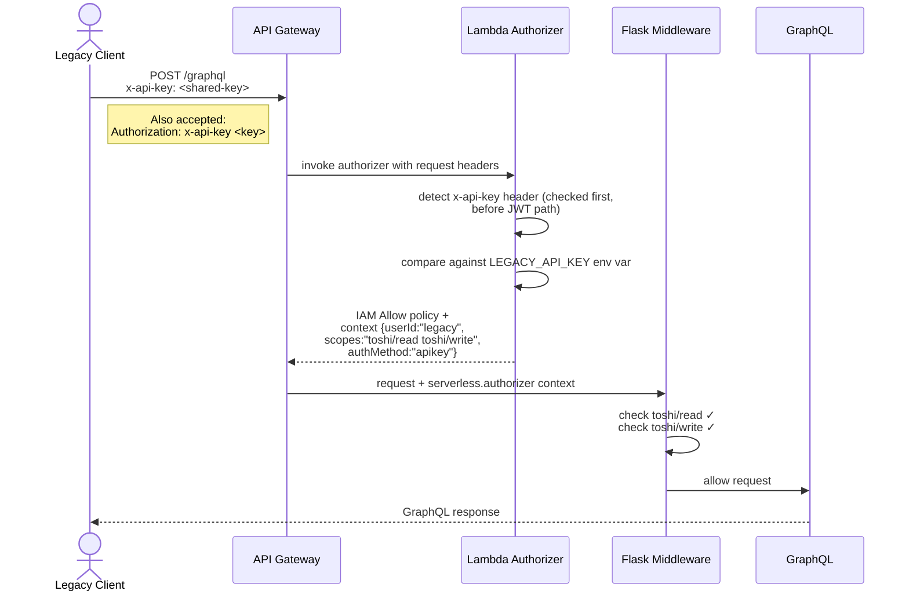
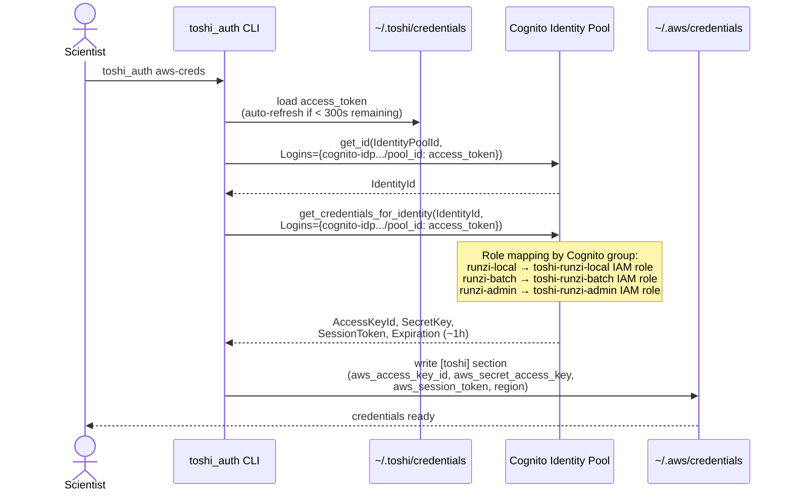
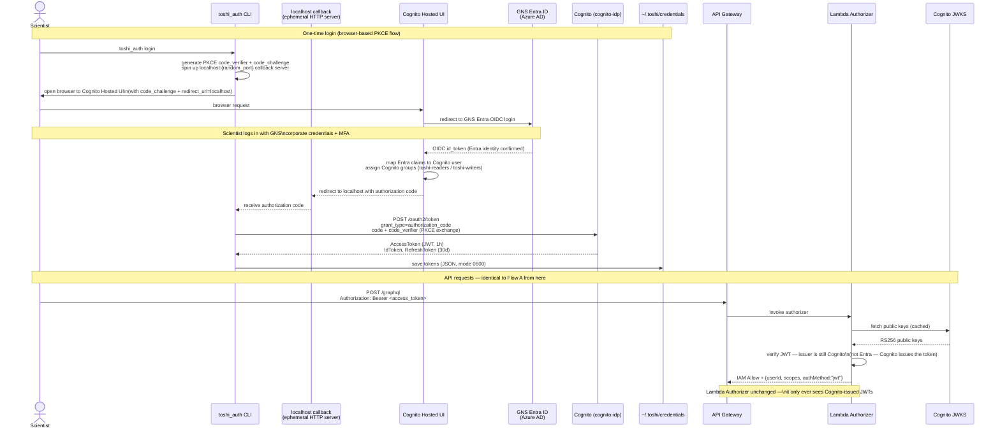
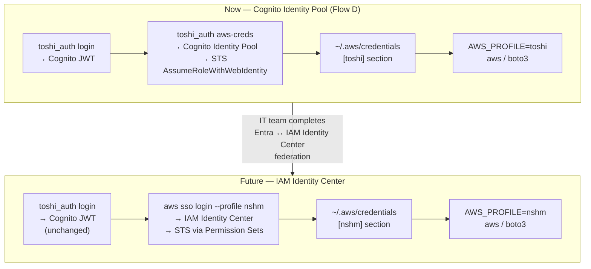

# Authentication Guide — nshm-toshi-api

This guide explains how to authenticate with the Toshi API as an end user. The API is migrating
from a single shared `x-api-key` to per-user Cognito JWTs, while maintaining backward compatibility
with legacy API key clients during the transition.

There are three client personas:

| Persona | Flow | Tool |
|---------|------|------|
| **Scientist** (interactive) | Cognito username/password → Bearer JWT | `toshi_auth.py login` |
| **Automation / Runzi** (M2M) | OAuth 2.0 Client Credentials → Bearer JWT | `toshi_auth.py m2m-token` |
| **Legacy client** (transition) | Shared `x-api-key` header | No change required |

> **Upcoming: GNS SSO integration.** Cognito will soon be federated with GNS Entra ID (Azure AD).
> Once live, scientists log in with their GNS corporate credentials via a browser — no separate
> Toshi password. The `toshi_auth login` command will handle this automatically. M2M flows and
> the Lambda Authorizer are **unchanged**. See [Flow E: SSO Login (Entra federation)](#flow-e-scientist-login-with-gns-sso-upcoming)
> and [Flow F: AWS credentials after SSO migration](#flow-f-aws-credentials-after-sso-migration-future).

---

## Architecture Overview

All requests pass through API Gateway and a Lambda Authorizer before reaching the Flask/GraphQL app.
The authorizer validates the token and injects auth context (user ID + scopes) for the Flask
middleware to enforce.



> **Key point:** Cognito is a permanent component — the Lambda Authorizer always validates
> Cognito-issued JWTs. Entra federation means Cognito *delegates authentication* to GNS Entra,
> but still issues the JWT. The authorizer and middleware are unchanged by the SSO migration.

---

## Flow A: Scientist Interactive Login

> **Current behaviour** (before GNS SSO is wired in). Scientists authenticate with a Toshi-specific
> username and password. See [Flow E](#flow-e-scientist-login-with-gns-sso-upcoming) for what changes
> once Entra is federated.

Scientists authenticate once with username and password. Tokens are stored locally and
auto-refreshed. Works from SSH terminals — no browser required.



### Quick Start

```bash
# Login (once)
uv run python auth/toshi_auth.py login

# Inspect your token and group membership
uv run python auth/toshi_auth.py whoami

# Make an API call
TOKEN=$(uv run python auth/toshi_auth.py token --raw)
curl -H "Authorization: Bearer $TOKEN" \
     -H "Content-Type: application/json" \
     https://<api-url>/graphql \
     -d '{"query":"{ about }"}'
```

---

## Flow B: Automation / Runzi (Machine-to-Machine)

Runzi and other automated pipelines use the OAuth 2.0 Client Credentials grant. There is no
user identity — the token identifies the automation client itself. Tokens last 1 hour and cannot
be refreshed — a new one must be requested when the old one expires.

For jobs shorter than ~50 minutes a single token at startup is sufficient. For long-running jobs
(hours to days) use `ToshiTokenManager` from `nshm-toshi-client`, which handles re-fetch
transparently inside the transport layer — application code never touches tokens directly.



### Python (all Runzi jobs and scripts)

No application code changes required. Set three environment variables in the job environment
(Batch job definition, CI/CD secrets, or local `.env`) and `nshm-toshi-client` wires up
token management automatically:

| Variable | Sensitivity | Source |
|----------|-------------|--------|
| `NZSHM22_TOSHI_COGNITO_CLIENT_ID` | Low — public | `auth/auth_config.json` |
| `NZSHM22_TOSHI_COGNITO_CLIENT_SECRET` | **High — treat as password** | `auth/.env` (gitignored) |
| `NZSHM22_TOSHI_COGNITO_DOMAIN` | Low — public | `auth/auth_config.json` |

#### Handling `NZSHM22_TOSHI_COGNITO_CLIENT_SECRET`

This secret allows anything that holds it to mint valid API tokens with full read+write access.
It must be handled with the same care as a password:

| Context | How to supply it |
|---------|-----------------|
| AWS Batch job containers | Secrets Manager → env var injection at job start (same pattern as current `NZSHM22_TOSHI_API_SECRET_*`) |
| CI/CD pipelines | GitHub Actions secret (or equivalent) — never in source |
| Local dev | `auth/.env` (gitignored) — already the established pattern |

**Never** put it in `auth_config.json` (committed), directly in a Batch job definition (visible
in AWS console), application code, or log output.

It can be rotated in Cognito at any time without touching application code — just update the
value in Secrets Manager and redeploy. This is an improvement over the current shared `x-api-key`,
which requires a coordinated update across all consumers. Cognito also logs every token issuance,
so any misuse is auditable.

Existing application code continues to work unchanged:

```python
# No changes needed — token management is handled by the library
api = RuptureGenerationTask(API_URL, S3_URL, auth_token=None, headers=None)
```

The client detects the Cognito env vars at startup, creates a `ToshiTokenManager` internally,
and silently re-fetches tokens near expiry. Jobs of any duration work correctly.

### Shell / curl (one-off testing only)

Only use the CLI directly when calling the API outside Python — e.g. manual `curl` tests.
The token is valid for 1 hour; re-run if it expires.

```bash
TOKEN=$(TOSHI_CLIENT_ID=<id> TOSHI_CLIENT_SECRET=<secret> \
        uv run python auth/toshi_auth.py m2m-token --raw)

curl -H "Authorization: Bearer $TOKEN" \
     -H "Content-Type: application/json" \
     https://<api-url>/graphql \
     -d '{"query":"{ about }"}'
```

---

## Flow C: Legacy x-api-key (Transition Period)

Existing clients using the shared `x-api-key` continue to work unchanged during the migration.
The Lambda Authorizer checks the key against the `LEGACY_API_KEY` environment variable and grants
full read+write access if it matches.



> **Note:** The `x-api-key` path will be removed once all clients have migrated to JWT auth.
> Check the changelog for deprecation notices.

---

## Flow D: AWS Credentials via Identity Pool

Scientists who need temporary AWS credentials (for S3, ECR, etc.) can exchange their Cognito
access token for short-lived IAM credentials scoped to their Runzi role.



### Quick Start

```bash
# Exchange Cognito token for AWS credentials
uv run python auth/toshi_auth.py aws-creds

# Use the [toshi] profile
export AWS_PROFILE=toshi
aws ecr describe-repositories --region ap-southeast-2
aws s3 ls s3://my-nshm-bucket/
```

> Credentials expire in ~1 hour. Re-run `aws-creds` to refresh.

---

## Flow E: Scientist Login with GNS SSO (upcoming)

Once GNS Entra ID is federated into Cognito (Phase 2), scientists log in with their GNS corporate
credentials via a browser. The `toshi_auth login` command handles the PKCE flow automatically —
the same command, a different exchange underneath.

**What changes for scientists:** browser opens instead of a password prompt.
**What doesn't change:** `toshi_auth token`, `toshi_auth whoami`, `aws-creds`, all API calls —
identical to today. The Lambda Authorizer and middleware are completely unaffected.



### SSH / headless fallback

For terminals without a browser (remote servers, HPC):

```bash
toshi_auth login --no-browser
# Prints: Open this URL in a browser: https://toshi-auth.xxx.auth.../login?...
# Paste the redirected localhost URL back when prompted
```

### Quick Start (after SSO is live)

```bash
# Login — browser opens to GNS SSO
uv run python auth/toshi_auth.py login

# Everything else identical to today
uv run python auth/toshi_auth.py whoami
TOKEN=$(uv run python auth/toshi_auth.py token --raw)
curl -H "Authorization: Bearer $TOKEN" https://<api-url>/graphql -d '{"query":"{ about }"}'
```

---

## Flow F: AWS Credentials after SSO Migration (future)

Currently, `toshi_auth aws-creds` exchanges a Cognito token for temporary STS credentials via
the Cognito Identity Pool (Flow D). Once the IT team completes Entra ↔ IAM Identity Center
federation, scientists can use the standard `aws sso login` instead — one less custom command.

**Cognito remains permanent.** This migration only affects how AWS service credentials (S3, ECR,
Batch) are obtained. The Toshi API JWT flow is unchanged in both current and future states.



### What triggers the migration

- IT team federates Entra into IAM Identity Center (their task, their timeline)
- IT team creates Permission Sets matching the policies in `auth/iam_roles.py`
- Scientists switch one command: `toshi_auth aws-creds` → `aws sso login --profile nshm`
- `toshi_auth login` for Toshi API access is **unchanged throughout**

### Why not start with IAM Identity Center

The Identity Center approach requires IT team to complete Entra federation before anyone can get
AWS credentials. The Cognito Identity Pool path (Flow D) gives the team full AWS service access
now, with a clean handover when IT team is ready. See `auth/IDP_INTEGRATION_OPTIONS_STUDY.md`
for the full trade-off analysis.

---

## Scopes Reference

| Scope | Required for |
|-------|-------------|
| `toshi/read` | All GraphQL queries |
| `toshi/write` | GraphQL mutations (create/update operations) |

Scopes are granted based on Cognito group membership:

| Group | Scopes granted |
|-------|---------------|
| `toshi-readers` | `toshi/read` |
| `toshi-writers` | `toshi/read` + `toshi/write` |

---

## Token Reference

| Token | Lifetime | Refreshable | Stored at |
|-------|---------|------------|-----------|
| Scientist access token | 1 hour | Yes (via refresh token) | `~/.toshi/credentials` |
| Scientist refresh token | 30 days | N/A | `~/.toshi/credentials` |
| M2M access token | 1 hour | No — re-request on expiry | Cached in `ToshiTokenManager` (in-process) |
| AWS temp credentials (now) | ~1 hour | No — re-run `aws-creds` | `~/.aws/credentials [toshi]` |
| AWS SSO credentials (future) | ~8 hours | Auto (sso-session) | `~/.aws/sso/cache/` |

---

## Troubleshooting

| Symptom | Cause | Fix |
|---------|-------|-----|
| `401 Unauthorized` | Token missing, expired, or invalid signature | Re-run `toshi_auth login` or `m2m-token` |
| `403 Missing required scope: toshi/read` | User not in `toshi-readers` or `toshi-writers` group | Ask an admin to add you to the correct Cognito group |
| `403 GraphQL mutations require scope: toshi/write` | User is in `toshi-readers` only | Ask an admin to add you to `toshi-writers` |
| CORS error on token fetch | Cognito `/oauth2/token` has no CORS headers | Run from a DevTools console on a `localhost` tab, not from a page origin |
| `aws-creds` fails with no credentials | Not logged in, or token too stale to auto-refresh | Re-run `toshi_auth login` first |
| Browser doesn't open on `toshi_auth login` (after SSO) | Headless terminal or browser launch failed | Use `toshi_auth login --no-browser` and paste the URL |
| Login redirects to Entra but fails with account error | GNS Entra account not provisioned or MFA not set up | Contact IT team |
| Entra login succeeds but API returns 403 | Cognito group not assigned for your account | Contact dev team admin to assign `toshi-readers` or `toshi-writers` group |

---

## Local Development

Auth enforcement is **bypassed** when `SLS_OFFLINE=1` or `TESTING=1`. Local dev and test runs
are unaffected — the middleware sets a synthetic user `{userId: "local-dev", scopes: {toshi/read, toshi/write}}`.

```bash
# Local stack — no auth required
yarn sls dynamodb start --stage local &
yarn sls s3 start &
uv run yarn sls wsgi serve   # Flask on http://localhost:5000/graphql
```
